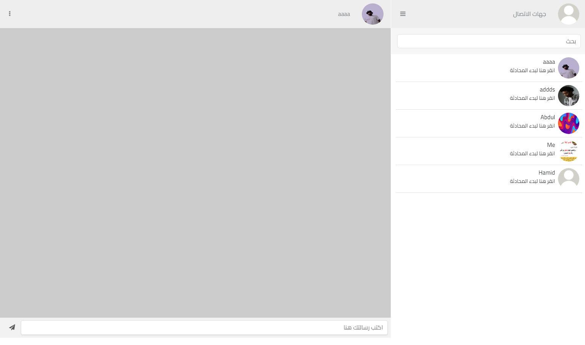
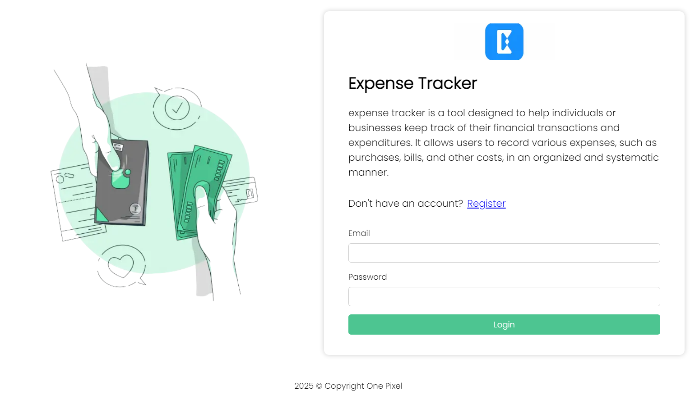
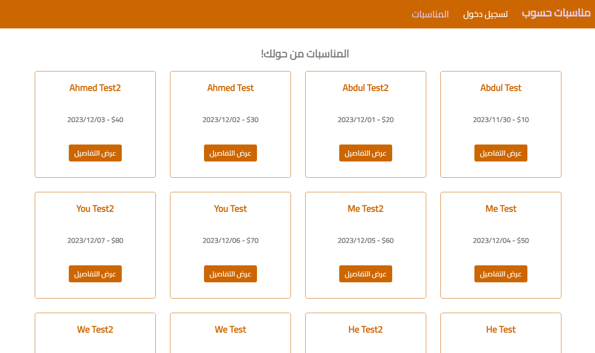
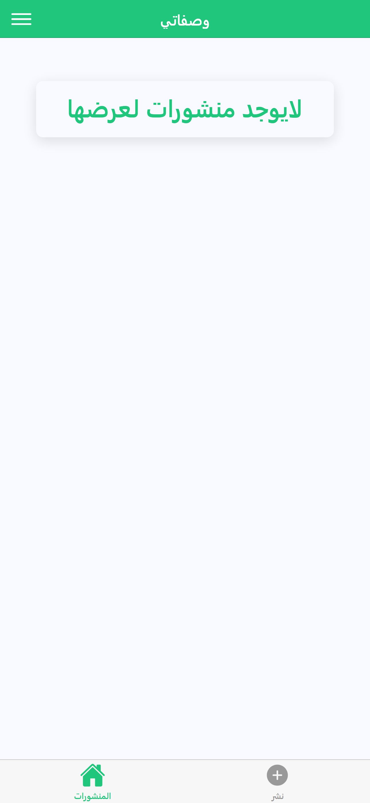
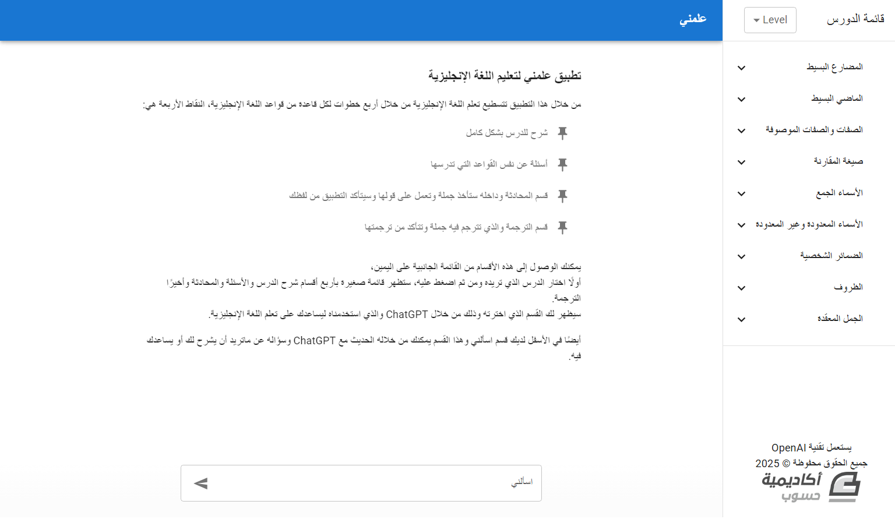
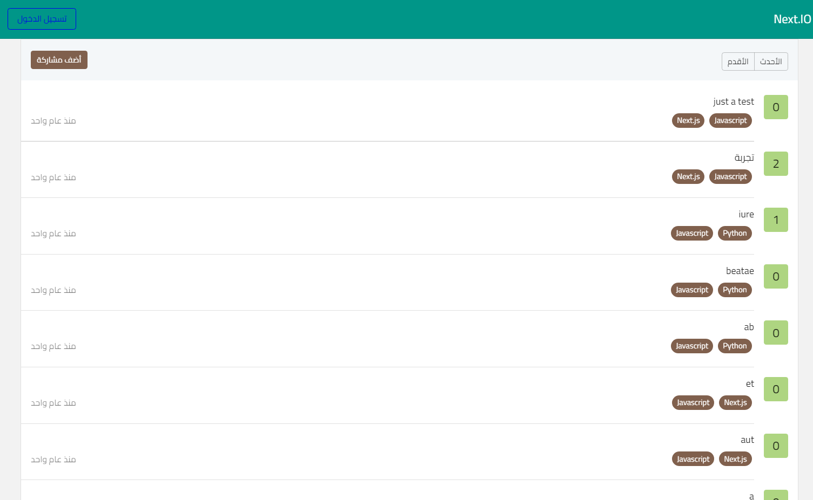
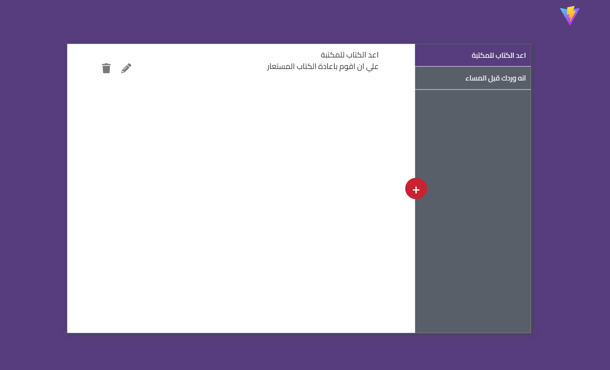

# Hsoub Academy JavaScript Development Projects

Welcome to my showcase repository for the JavaScript development projects I
completed as part of my journey at **Hsoub Academy**! These projects reflect my
growth and understanding of JavaScript, showcasing a range of practical and fun
applications. 🚀

## About Hsoub Academy 🌟

**Hsoub Academy** is a platform dedicated to empowering individuals with
practical skills in programming, design, and development. The academy emphasizes
real-world projects to ensure students gain hands-on experience and are prepared
for professional opportunities.

My experience with Hsoub Academy has been incredibly enriching. It has enhanced
my problem-solving abilities, technical skills, and creativity in software
development. Each project was a step toward becoming a proficient JavaScript
developer. 💻

---

## Projects Showcase 🖼️

Below is a list of the projects I completed, along with descriptions,
screenshots, and direct links to explore them.

### 1. **ChatApp** 💬

**Description**: A cross-platform messaging app available on mobile and web. The
mobile version was built with React Native and Expo, while the web version uses
React with Vite. Both versions leverage **Socket.IO** for real-time
communication. The server-side is powered by Node.js, Express, and MongoDB
(Mongoose).

**[Explore the Project Folder](./projects/chatapp)**

---

### 2. **ElectronTodolist** 📝

**Description**: A desktop to-do app built with **Electron.js**. It lets users
create tasks with optional notifications. When an alarm is set, the app reminds
the user at the specified time.

**[Explore the Project Folder](./projects/electron-todolist)**

---

### 3. **ExpenseTracker** 💰

**Description**: A responsive web app for tracking expenses, built with
**Next.js 13** and styled using pure CSS. It includes a **Chart.js** integration
for visualizing expenses and supports multiple languages (English and Arabic)
using **next-intl**.

**[Explore the Project Folder](./projects/expense-tracker)**

---

### 4. **GraphQLBooking** 🎟️

**Description**: A web app for creating and booking events. The frontend is
developed with React and Apollo Client, styled using React-Bootstrap. The
backend uses Node.js, Express, MongoDB, GraphQL, and Apollo Server.

**[Explore the Project Folder](./projects/graphql-booking)**

---

### 5. **IonicMyRecipes** 🍳

**Description**: A cross-platform app built with the **Ionic Framework**. Users
can upload images of recipes, list ingredients, and add descriptions. The
frontend uses React Ionic and Swiper for image sliders. The backend features
Node.js, Express, PostgreSQL (Sequelize), and JSON Web Tokens (JWT) for
authentication.

**[Explore the Project Folder](./projects/ionic-my-recipes)**

---

### 6. **LanguageLearning** 🗣️

**Description**: A language learning platform designed to help non-English
speakers improve their English skills with the power of AI. Built using
**Next.js 13** and styled with Material-UI, it integrates OpenAI’s API for
answering grammar and vocabulary questions, as well as enabling conversational
practice.

**[Explore the Project Folder](./projects/language-learning)**

---

### 7. **MoviesAPI** 🎥

**Description**: A backend project providing a comprehensive movies API. Users
can retrieve movie information, create playlists (e.g., "Want to Watch",
"Watching"), and add movies. Admin users have the ability to add new movies.
Built with Node.js, Express, MongoDB, and JWT for authentication.

**[Explore the Project Folder](./projects/movies-api)**

---

### 8. **mydoctor** 🩺

**Description**: A mobile app for connecting users with nearby doctors. Built
using React Native for the frontend and Node.js with Express for the backend.
PostgreSQL (Sequelize) manages the database. Features include geolocation for
finding the nearest doctors and user role differentiation (normal users vs.
doctors).

**[Explore the Project Folder](./projects/mydoctor)**

---

### 9. **NextIO** ❓

**Description**: A Q&A platform allowing users to sign up, post questions, and
provide answers. Built with **Next.js 13**, styled using Material-UI, and
secured with JWT for authentication.

**[Explore the Project Folder](./projects/nextio)**

---

### 10. **ReactNotes** 🗒️

**Description**: A simple note-taking web app. Users can perform CRUD operations
using local storage. Built with React and styled using CSS.

**[Explore the Project Folder](./projects/react-notes)**

---

## My Thoughts 💭

Completing these projects at Hsoub Academy was a transformative experience. Each
project challenged me to apply theoretical knowledge in practical scenarios,
improving my problem-solving and coding skills. Hsoub Academy’s approach to
learning through projects has been invaluable, and I’m excited to continue
building and sharing more projects. 🌈

---

Thank you for visiting my repository! I hope these projects inspire and showcase
the possibilities of JavaScript development. ✨
